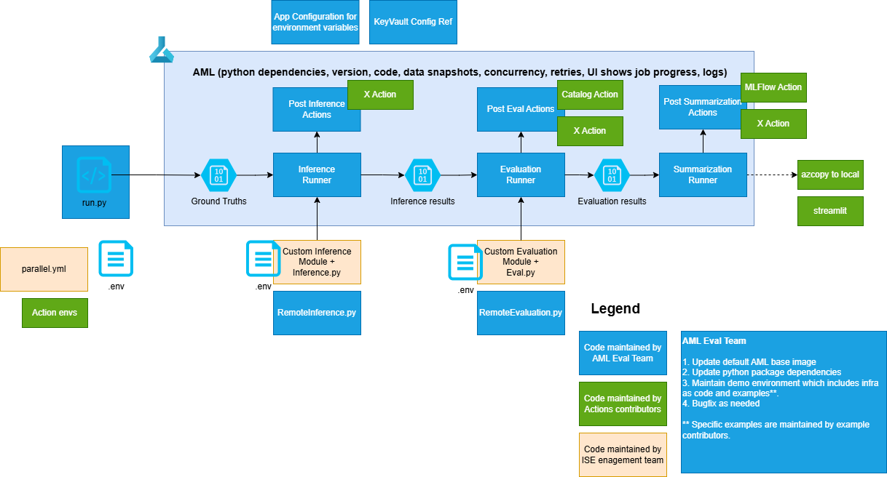

# Design

The following shows the design. It consists of a client side script for kicking off experiments as well as the 3 steps of an experiment - inference, evaluation and summarization.

1. The input and output for each step is going to be generic and the most generic data structure is a `dict` data type in python.
2. The runner supports 2 types of inference and evaluation. The first version is a module based approach where we will invoke a `inference.py` and `eval.py` files directly and look for a function we can use in both cases. The second version is to invoke an HTTP endpoint. It will be a `JSON` data payload and we expect a `JSON` data payload back.
3. The runner is going to be configuration driven and will read in `.env` files for the runner itself, inference and evaluation.
4. There will be post actions in each of the steps. The actions will be invoked after the completion of inference, evaluation and summarization. If an exception is raised, the exception will be caught and logged only.
5. The jobs will be stored in the following prefix `experiment_name/job_id` followed by inference, evaluation. This data structure allows for ease of pulling data back for analysis later.
