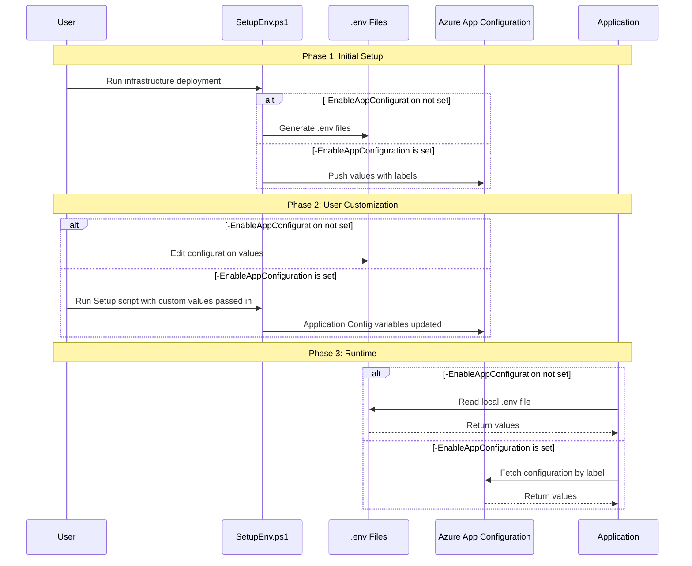

## Overview

## Status

Proposed

## Context

The platform currently generates multiple `.env` files during infrastructure setup (`SetupEnv.ps1`), each targeting a specific component:

| File | Purpose |
|------|---------|
| `ingestion/.env` | Configuration for uploading ISE Dev Blogs to storage account |
| `search/.env` | Configuration for deploying container app for markdown parsing and other search indexer components |
| `inference/foundryv2agent/.env` | Configuration for AI agent setup |
| Downstream experiment `.test.env` | Configuration for AML experiments in a downstream orchestration repo |

This prep tree does not include the former top-level `experiment/` directory, but the configuration model still needs to account for experiment-level settings consumed outside the published repo.

**Problems with the current approach:**
1. No centralized way to manage configuration across different folders
1. Local files can drift from intended configuration

## Decision

Implement a hybrid configuration system, allowing users to *either* use Azure App Configuration or local `.env` files.

### Configuration Flow



### Label Strategy

Each environment variable is stored in Azure App Configuration with a label indicating its associated component:
* `search`
* `ingestion`
* `agent`
* `experiment`

## Scripts

The existing `infra/SetupEnv.ps1` file will have an optional flag added that ensures the solution references Azure App Configuration.

```powershell
./SetupEnv.ps1 -EnableAppConfiguration
```

By setting this flag, only one top-level `.env` file is generated with the `CONFIG_SOURCE` variable, the value of which would be the name of the associated Azure Application Config resource. No additional `.env` files are generated.

```bash
CONFIG_SOURCE="auol24f0a-d-appconfig"
```

## Implementation Plan

### Phase 1: Scripts
* Update `SetupEnv.ps1` to push values to Azure App Config if `-EnableAppConfiguration` flag is set

### Phase 2: Configuration Loader
* Create shared Python and/or Powershell module for Azure App Configuration loading

### Phase 3: Component Integration
* Update each component that currently uses a .env (search, ingestion, agent, and experiment) to use the configuration loader
* Add documentation for configuration management

## Consequences

### Positive
- Centralized configuration management
- Easy to track configuration changes via App Configuration history
- Local development still works with `.env` files

### Negative
- Slightly more complex configuration loading logic
